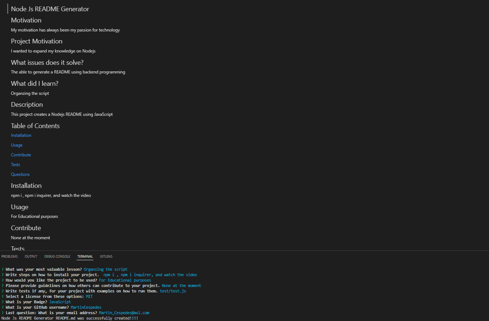

## Nodejs README Generator

- [Live Demo](https://drive.google.com/file/d/1md8Tvh4twhZm03Pvl2_-zqjyVWlu3gUl/view)

- 

- 

- 

## Contents

[Description](#description)

[User Story](#user-story)

[Installation](#installation)

[Usage](#usage)

[Features](#features)

[Application Screenshot Preview](#application-screenshot-preview)

[Resources & Credit](#resourcescredit)

[License](#license)

## Description

## User Story

```md
- AS A developer

- I WANT a README generator

- SO THAT I can quickly create a professional README for a new project
```

## Installation

- To install the Nodejs README Generator, you'll need to follow these steps:

1. Clone the repository to your local machine using the following command:

```md
git clone https://github.com/<username>/<repository>.git
```

2. Navigate to the root directory of the project using the following command:

```md
cd <repository>
```

3. Install the required dependencies using the following command:

```md
npm install
```

## Usage

- To use the Nodejs README Generator, you'll need to follow these steps:

1. Navigate to the root directory of the project using the following command:

```md
cd <repository>
```

2. Run the generator using the following command:

```md
node index.js
```

3. Follow the prompts to enter the necessary information about your project.

4. Once you've entered all the information, the generator will create a README.md file in the root directory of your project.

## Features

- The Nodejs README Generator has the following features:

```md
- Prompts the user to enter information about their project, including the project title, description, installation instructions, usage information, contribution guidelines, test instructions, license, GitHub username, and email address.

- Generates a high-quality, professional README.md file with the title of the project and sections entitled Description, Table of Contents, Installation, Usage, License, Contributing, Tests, and Questions.

- Adds the information entered by the user to the appropriate sections of the README file.

- Adds a badge for the selected license to the top of the README file.

- Adds the user's GitHub username and email address to the Questions section of the README file, with a link to the user's GitHub profile and instructions on how to reach the user with additional questions.

- Includes a Table of Contents with links to the corresponding sections of the README file.

- Uses modern JavaScript syntax and Node.js features
```

## Application Screenshot Preview



## Resources/Credit

- Author: Martin Cespedes - [Link to my Github](https://github.com/MartinCespedes)

## License


Copyright (c) 2023 Martin Cespedes

This project is licensed under the terms of the MIT license.
